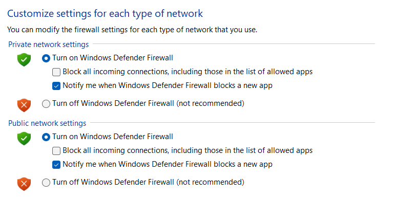
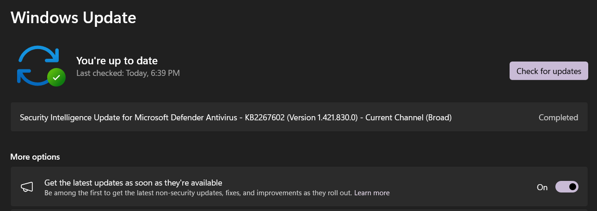
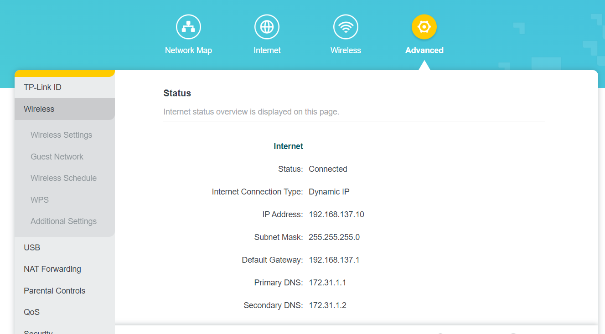
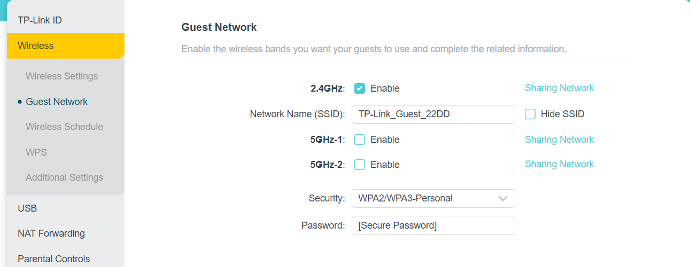

# Fundamental Practices

## Installing And Using SSH

To begin, I open up the terminal in my Kali Linux VM and enter the command "sudo apt install openssh-server"

I create a test folder for this lab and use a chain of CD commands to get into the test folder.

I type an ipconfig command to get my IP address for this VM.

I go to my Windows 10 box and download Putty and type the IP address in the host name.

I successfully log into my Kali SSH via my windows Putty, demonstrating a successful SSH install and connection.

## Securing Windows With Password Complexity

In this lab I set up my windows operating system to force users to have complex passwords.

First, open the run command and type 'gpedit.msc'

Then I open Windows Settings -> Security Settings -> Account Policy -> Password Policy

From here I can edit the password requirements and enable/ disable complexity requirements.

These requirements are not on by default, so enabling them is a good security practice most Windows users are not utlizing.

## Encrypting A Hard Drive

To keep my information safe from someone stealing my hard drive, I want to encrypt it.

Fortunately, this process is very easy.

On windows, I click on the start menu and type "device encryption"

A toggle for device encryption pops up, I turn it on, and now my hard drive is encrypted.

## Implementing Role Based Access Controls In Windows

In this lab I want to demonstrate how to asign roles to users and give those users access to certain features based on their assigned roles.

First, I right click the start menu and go to computer management.

Then, I go to system tools -> local users and groups -> users

In users I add the users 'Mary' and 'Bob'

Then I go to groups and add the groups 'Accounting' and 'Sales'

I add 'Mary' to the accounting group, and 'Bob' to the sales group.

With my users and groups set up, I go to the C:/ Drive and create the folders 'Accounting' and 'Sales'.

My goal from here is to make it so only the matching groups can access and edit their folders.

Furthermore, I want to make it so people in the Accounting group can read what's in the Sales folder, but not be able to make changes to it.

To edit the permissions, I right click on the Accounting folder and select properties.

I go to the security tab and I see that by default the folder has the same permissions as the C:/ Drive it is located in.

While the folder has these permissions, I cannot make any changes to its permissions. 

To fix this, I click on the advnaced button in the security tab, then click 'disbale inheritence'

This clears the folder of all permissions, and makes it unaccessible by anyone, including myself, the admin.

Next, I try to open the folder and windows opens a popup saying I don't have permission to access this file.

However, since I am the admin, it prompts me to give myself permission, so I select yes, then close the folder.

After closing the folder, I right click on the folder again, go to properties -> security -> Edit -> Add

From here I can add the Accounting group to the Accounting folder.

I give them 'Modify' control type, because I want them to be able to edit the contents of the folder.

I don't want them to have full control becuase then they would have the ability to alter permissions, which goes against the rules of least privilege.

I now do the exact same thing with the sales folder, but add the modify control type to the sales team.

However I also give "read and execute" control type to the Accounting group so they can read the contents but not make changes.

## Configure Firewall Rules

In this lab I want to activate my firewall and create an inbound rule to allow port 21 for my hosted FTP server.

First, I open the control panel and click "Windows Firewall Defender"

I select 'turn windows firewall defender on or off' on the left side column.

I turn the firewall on for both private and public connections.

Now that the firewall is on, I want to go to advanced settings so I can open port 21.

From advanced settings, I select inbound rules and click 'new rule'.

For rule type, I select port, then just follow the wizard to completion to allow port 21.

## Updating A Computer

In this lab I want to make sure my computer is up to date and stays updated in a safe manner.

First, I go to the windows search bar and type 'update'

I click 'check for updates'

I click the 'check for updates' button and the computer will prompt me to download any missing updates.

Since I am using a home computer, I toggle on the auto update feature.

If this were a work computer, I would leave this toggled off since updates can break software and I would want to test this first.

Since most updates requires the computer to restart to go into affect, I want to toggle the computer to auto restart after an update, but only during non-active hours.

To do this, I select advanced options and set my active hours to be the timeframe I am usually awake and using my computer.

This way, the computer will only restart during the time frame I would not be using the computer anyways.

## Securing A Wireless Network

In this lab I will be configuring an Archer AX3200 router.

I go to the configuration website and go to the advanced settings and open the wireless tab.

I go to wireless settings and change the security level from WPA2 to WPA3.

I change the version to WPA3 as well.

I hide the network name so only people who know the name of the network can find it.

I change the password to a complex passphrase.

I then open the guest network tab and configure the guest settings so they won't have to be connected to my sensitive devices.

I keep the SSID open, name the channel as a guest channel, and give it a secure password.

## Using Encrypting File System

[back](./)
