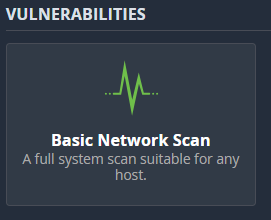

# Setting Up Network Security

## Using An IP Scanner

I want to scan all of the devices on my network, so to begin I download 'Angry IP Scanner'

I made sure I had java downloaded as I selected the standalone download option for my IP scanner.

Next, I open the run command and open my command prompt.

I use the command prompt to find the IP address of my device using ipconfig.

I run Angry IP Scanner and find 3 hosts on my network, and they all match my IP address.

## Vulnerability Scanner

Now I want to scan every device on my network at the same time.

To do this, I'm getting Nessus Essentials, a free network vulnerability scanner.

Once downloaded, the application opens in the browser, and I go to the URL on the app page and copy and paste the local host section of the URL and save it as a .txt file on my desktop.

I added s after http in my txt file for secure future use.

I perform an ipconfig command to get my ip address so I can use it to run a network scan.

Next, I go to Nessus Essentials and select 'Basic Network Scan' and select the target my IP address/24.

The scanner gives me a list of vulnerabilities ranging from info to critical, as well as telling me how to fix the issue.

[back](./)
