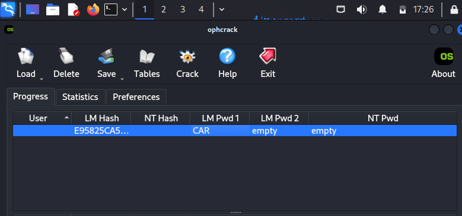

# Pentesting

## Scanning A Website For Vulnerabilities

For this project I'm going to run a vulnerability scan on the website we're on right now.

When scanning a website, it is important that you own/ have permissions on the website

If you don't, you aren't pentesting, you are being a hacker.

So I am going to scan [realcybershane](https://realcybershane.github.io/portfolio/)

I am going to use [pentest-tools.com](https://pentest-tools.com/website-vulnerability-scanning/website-scanner) to conduct the scan.

I scroll down the page and it gives a detailed explanation of all of the listed vulnerabilities and how to address them.

Were I a hacker, I could use this information to break into the system, but as the owner, I will use it to fix my site.

## Cracking A Password With Kali

In this lab, I am going to test my ability to crack basic dictionary passwords.

To start, it needs to be understood that passwords are stored as hashes, so I need a hash generator to conduct my testing.

After a quick google search, I landed on this NTLM Hash Generator, [tobtu](https://tobtu.com/lmntlm.php).

I use the site to generate a hash for the password "car" and get this hash: E95825CA576052CEAAD3B435B51404EE

I think open my Kali Linux VM, select the dragon icon, select password attacks, and select ophcrack.

I load the hash provided above and run it through the app, and the app is able to crack the hash, revealing the password to be 'car'.

I then tested what would happen if I had a hash from a more complicated password, with numbers and characters.

In this case, the password was P@ssw0rd.

The password cracking software was unsuccessful.

With ophcrack I am able to quickly crack basic passwords as long as I have the hash value, making these passwords very insecure.

Next, I want to try and crack the more complex dictionary password hash using a lookup table.

I take the NTLM hash for the previously unsuccessful 'P@ssw0rd', E19CCF75EE54E06B06A5907AF13CEF42 and paste it into [crackstation](https://crackstation.net/).

Crackstation has a word list of 15 billion entries, which will cover just about any dictionary word and its variants.

I also tested the hashes for 'P@ssw0rd1234' and 'P@ssw0rd0678'

The only password not on the list was P@ssw0rd0678, which shows it is important to not only use complex passwords, but uncommon passwords as well.

Replacing letters with characters and ending in '1234' is too typical and barely adds any extra security.

[back](./)
