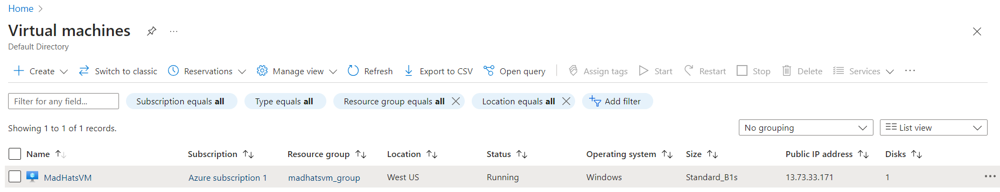
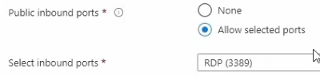
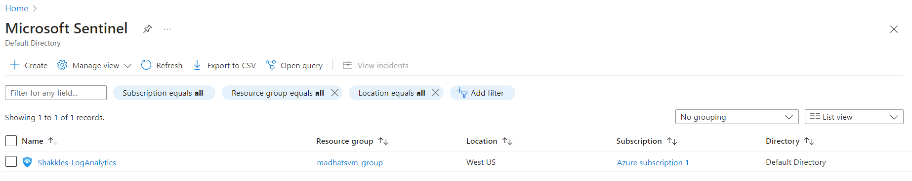
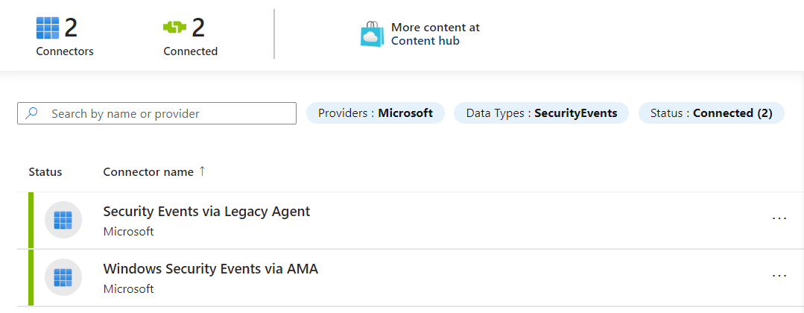
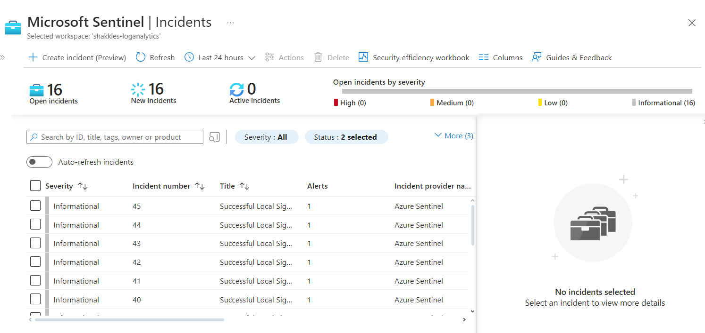
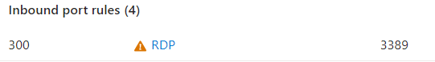
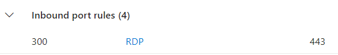

# Creating My Own SOC Using Microsoft Azure

I created my own Security Operations Center (SOC) by deploying my own SIEM that monitors and generates alerts for all of the devices in my personal home business lab. 

I also set up a threat intelligence feed that sends our SIEM commonly seen and newly found indicators of comprimise.


## Setting Up The Virtual Machine

First, I set up a Virtual Machine (VM) so I can monitor it's traffic flow.



When setting up the VM, I opened it to port 3389 (RDP), an insecure port, so I could test the application in a timely manner.




## Setting Up The SIEM

Next, I launched my own Microsoft Sentinel as my SIEM.



Then, I added the event logs from the VM I created to my newly deployed SIEM using a data connector.



Finally, I set up a rule that checks for successful sign-ins via RDP (brute force attacks) using the following code.

```js
SecurityEvent 
|where Activity contains "success" and Account contains "system"
```


## Results

After letting the system run for a while, these were the results/ proof that the SIEM is working as intended.




## Conclusion

After testing the system and verifying that it works, I turned off port 3389 and switched to the secure port 443.





And with that I have successfully created my own SOC and secured my system using the information the SOC provided.


[back](./)
