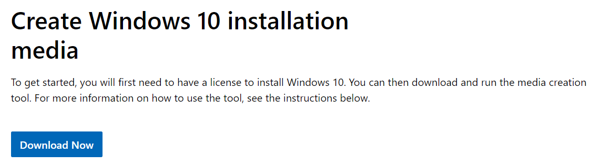
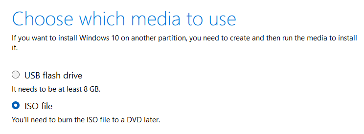
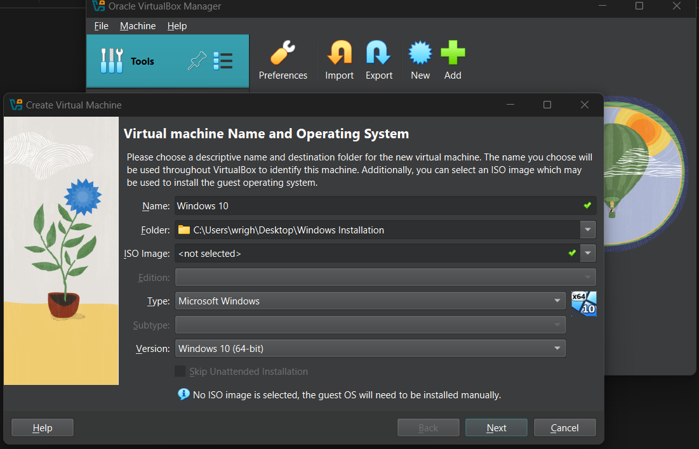
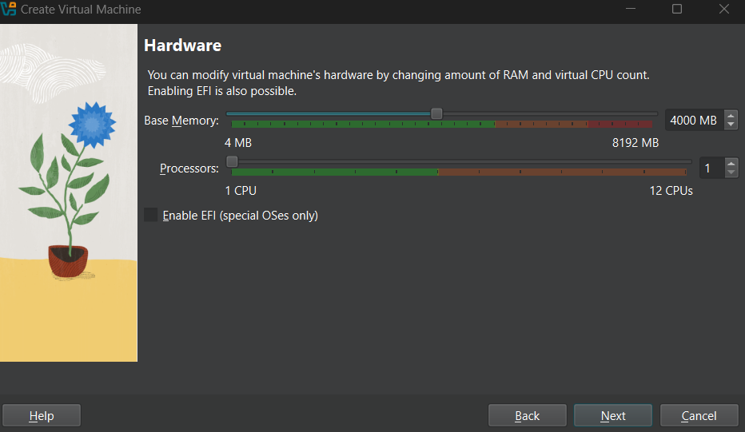
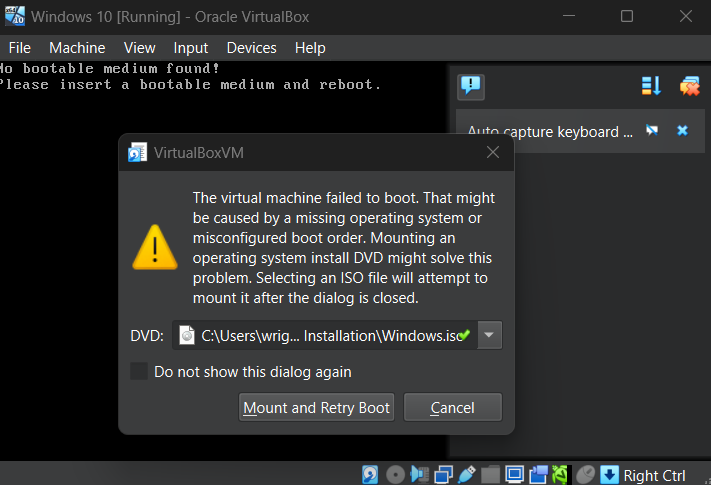
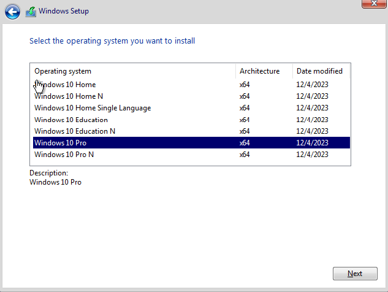
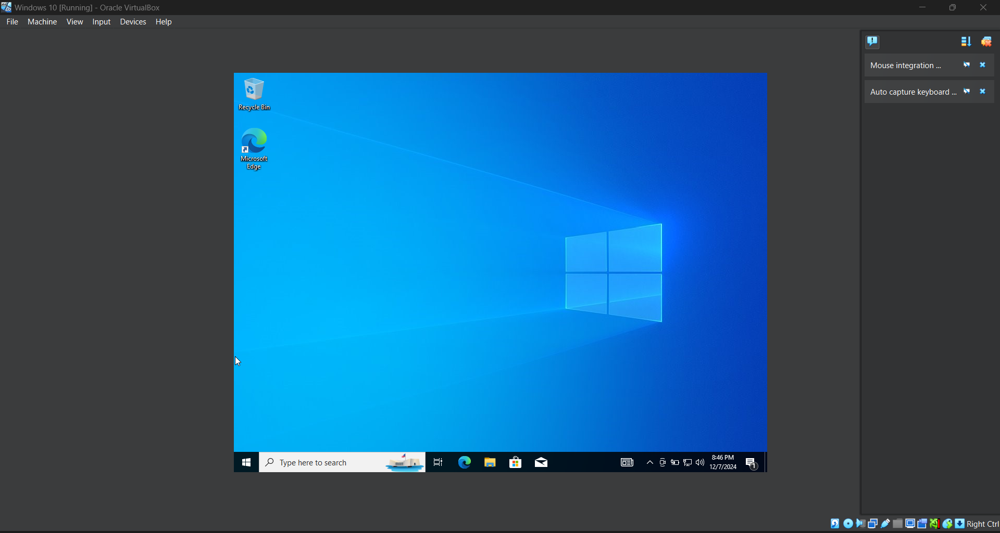
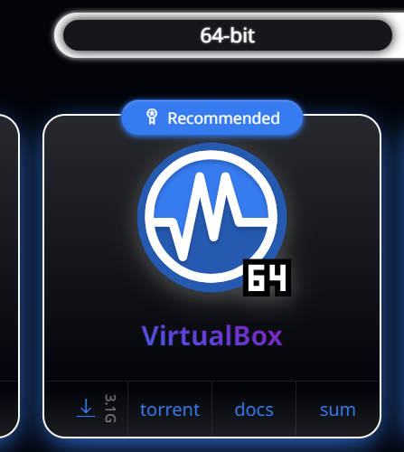
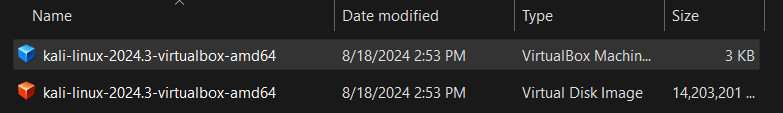
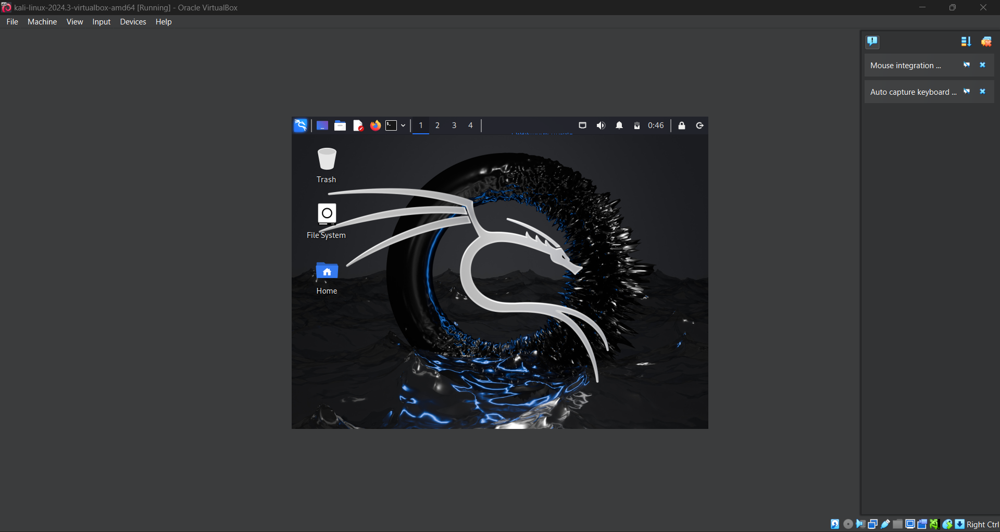

# Setting Up My Virtual Machines

## Installing Windows On Virtual Box

To begin this project, I need to get Windows 10 on my Virtual Box. To do this, I need a windows iso file.

First, I go to the windows website so I can download the widnows 10 ISO file.

I make sure I download the ISO file and not anything else.

Next, I created a new VM to install the ISO on.

I have a low end computer so I have the VM minimal computing power.

After creating the VM, I launch it and it tells me to install the ISO, which I then locate the ISO file for installation.

Once finished, I go through the windows installation wizard to install windows onto my VM.

I made sure to install Windows 10 Pro

Once I finished with the Windows installation wizard, the VM setup is complete.

## Installing Kali Linux On Virtual Box

Now I want to make another VM with Kali Linux.

First, I go to kali.org/get-kali and get the VM download for Virtual Box

I open the installed file and double  click the blue icon, which then opens up virtual box with Kali Linux already installed.

By default, the RAM was set to 2 gigabyts, I changed it to 4.

I then hit start and power up the kali linux VM.

I log into Kali using the default credentials (Kali, Kali).

Now Kali Linux is officially set up on my Virtual Box.

[back](./)
